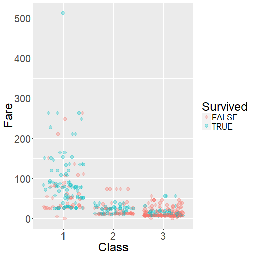
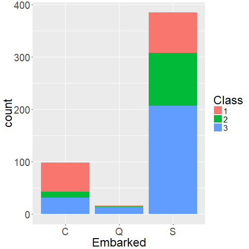
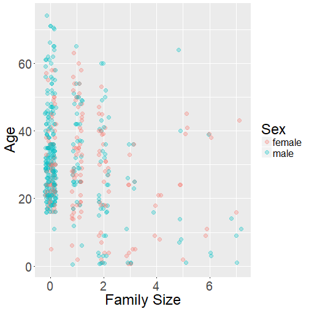
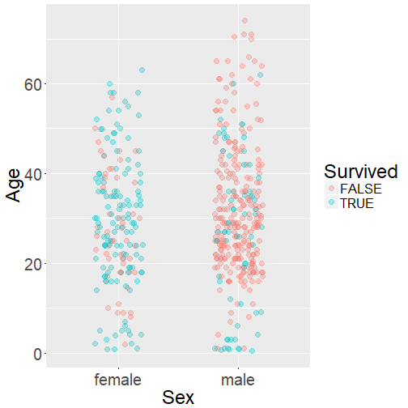

Analysis of Titanic Survival Data
========================================================
author: Andras Horvath
date: april 25, 2018
autosize: true

<style>
.small-code pre code {
  font-size: 1em;
}
.small-list li {
  font-size: 24px;
}
</style>


Datasets
==========

1. Summarized Titanic dataset ([R dataset](https://github.com/vincentarelbundock/Rdatasets/blob/master/csv/datasets/Titanic.csv))
  - Ticket classes available
  - Summarized survival frequencies

2. Kaggle Titanic dataset from: <https://www.kaggle.com/c/titanic/data>
  - Ticket classes available
  - Ticket fares available
  - Records for each passenger
  
### Question:
What ticket maximizes the chance of survival of the disaster?


Titanic dataset
==========


### Features:
  * Class:  
      1st : 325  
      2nd : 285  
      3rd : 706

  - Sex:  
      Male : 1731  
      Female : 470

  - Age:  
      Child : 109  
      Adult : 2092
      
***
  - Survived:  
      No : 1490   
      Yes : 711

  - Freq:  
      0 - 670


Analytic approaches
==========

1. Inferential analysis
  + Estimate probabilities from group frequencies
  + Test if survival is dependent on ticket class (Chi-Squared test of independence)

2. Fitting model to data and learn from coefficients
  + Coefficients indicate that the effect is positive or negative
  + Significance of the effects can be estimated
  + The models should return probabilities  

  2a. Binomial regression to survival outcome  
  
  2b. Linear regression to survival probabilities
  


1. Inferential analysis
==========
class: small-code


### Example: Male, Adult

```
    Probability  Compare:1st  Compare:2nd  Compare:3rd
1st  0.32571429 1.000000e+00 1.940208e-07 2.805261e-05
2nd  0.08333333 1.940208e-07 1.000000e+00 5.077105e-02
3rd  0.16233766 2.805261e-05 5.077105e-02 1.000000e+00
```

### Example: Female, Child

```
    Probability Compare:1st Compare:2nd Compare:3rd
1st   1.0000000           1         NaN         NaN
2nd   1.0000000         NaN 1.000000000 0.006439692
3rd   0.4516129         NaN 0.006439692 1.000000000
```
- Returns actual probabilities
- Indicates reliability (Chi-Squared test is unreliable at low frequencies)


2a. Binary regression
==========
class: small-code

```
              Estimate Std. Error    z value     Pr(>|z|)
(Intercept)  0.6853195  0.2729942   2.510381 1.206011e-02
SexFemale    2.4200603  0.1404101  17.235662 1.434015e-66
AgeAdult    -1.0615424  0.2440256  -4.350127 1.360589e-05
Class2nd    -1.0180950  0.1959975  -5.194428 2.053497e-07
Class3rd    -1.7777622  0.1715665 -10.361940 3.693921e-25
ClassCrew   -0.8576762  0.1573389  -5.451140 5.004800e-08
```
**Intercept**: Male and Child at 1st class  
**Effect of Age**: Adults have lower chance of survival  
**Effect of Class**: 2nd and 3rd Classes decrease the chance of survival


2b. Linear regression
==========
class: small-code

```
              Estimate Std. Error   t value     Pr(>|t|)
(Intercept)  0.5836454 0.18849545  3.096337 0.0147473288
SexFemale    0.4906798 0.09080429  5.403707 0.0006431663
AgeAdult    -0.1812957 0.16170425 -1.121156 0.2947450705
Class2nd    -0.1860801 0.13029185 -1.428179 0.1910936087
Class3rd    -0.3067344 0.10936566 -2.804669 0.0230315084
ClassCrew   -0.1755538 0.11039205 -1.590276 0.1504365381
```
**Intercept**: Male and Child at 1st class  
**Effect of Age**: Adults have lower chance of survival, but not significant according to the model  
**Effect of Class**: 2nd and 3rd Classes decrease the chance of survival, but the effect is significant only in the case of 3rd Class 


Compare approaches
==========

We use these models for probability estimation which is continous.  
Accuracy measure: Root mean squared deviance (RMSD) of predicted probabilities relative to actual probabilities

- Inferential analysis:  
  returns actual probabilities (RMSD = 0)

- Binary regression model:  
  RMSD = 0.0894474

- Linear regression model:  
  RMSD = 0.0963149


Conclusion
==========

- All the three approaches indicate that buying a First class ticket garantees the highest chance of survival.

- All the three approaches return probabilities for a given condition (Sex, Age)

- The Inferential analysis provides the most accurate probability


Titanic Kaggle dataset
==========

The dataset conists of 891 records.  
Variables:
- Passenger ID
- Name
- Sex: 64.76% males
- Age: 0.42 - 80; 177 NAs
- No of siblings / spouses on board
- No of parents / children on board

***
- Class
- Fare: 0 - 512.3292
- Cabin: 687 NAs
- City embarked: 2 NAs
- Ticket ID
- Survived: 38.38%


Cleaning dataset
==========
class: small-list


Included variables:|
-------
Sex|
Age|
Family: no of family members on board (siblings, spouses, parents, children)|
Class|
Fare|
High fare: Is the fare higher than the median of prices|
City embarked|
Survived|

***
Handling missing values:
- Age: filtering NAs  
(other option: replace by median)
- City embarked: filtering NAs

Continous variable scaling/normalizing:
- Age, Fare: perfomed but did not make predictions better

Subsetting:
- Randomized subsetting to 70% training and 30% test set


Exploratory data analysis
==========
class: small-list
Fare and Class:  

***
Embarked City and Class:  

  
- Embarked Cities: Cherbourg, Queenstown, Southampton


Exploratory data analysis
==========

Demography:  

***
Sex, age and survival:  



Machine learning
==========
class: small-list

Performed for each model:  
- Selecting parsimonious model (fewest features)
- Parameter/kernel optimization  

Model                | Accuracy (%)                     | Precision (%)                    | Recall (%)
---------------------|----------------------------------|----------------------------------|--------------------------------
Binary (all features)| 79.34   | 78.57   | 71.74
Binary, Lasso (Sex, Age, Family, Class, Fare, Embarked City)  | 81.69 | 83.54 | 71.74
SVM, linear (Sex, Age, Family, Class)   | 81.22   | 82.5   | 71.74
LDA (Sex, Age, Family, Class, High Fare)   | 81.22   | 80.95   | 73.91
GAM (Sex, Age, Family, Fare, High Fare)   | 81.69   | 82.72   | 72.83
  
  

Effect of Class and Fare
==========
class: small-code
Coefficients of binary regression:

```
                 Estimate  Std. Error      z value     Pr(>|z|)
(Intercept)   4.085067335 0.714008198  5.721317129 1.057014e-08
Pclass2      -1.209435933 0.433819397 -2.787878873 5.305438e-03
Pclass3      -2.453714284 0.497564028 -4.931454335 8.161965e-07
Sexmale      -2.306541653 0.254577621 -9.060268716 1.301296e-19
Age          -0.054673621 0.010262372 -5.327581293 9.952924e-08
Fare          0.001454972 0.003360138  0.433009532 6.650078e-01
EmbarkedQ    -0.006054192 0.772373491 -0.007838426 9.937459e-01
EmbarkedS    -0.146699036 0.316413600 -0.463630627 6.429124e-01
Family       -0.230547587 0.114311022 -2.016844764 4.371172e-02
FareHighTRUE  0.451418060 0.373671557  1.208061065 2.270238e-01
```
- Class 2nd and 3rd significantly decreases the chance of survival
- Increase of Fare and Fare above the median may increase the rate of survival but the effect is not significant


Summary
==========
- All machine learning approaches performed about the same accuracy around 80%
- The most accurate models were: binary regression with regularization and generalized additive model
- The most parsimonious models the support vector machine

Reasons for preference for SVM:
- Parsimonious thanks to dimension reduction
- Slight, less than 1% accuracy decrease compared to the most accurate models
- Based on this model, we can exclude the bare effect of Fare emphasizing rather the significant impact of Class on survival
